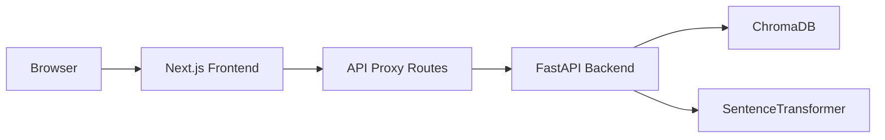

# 🖥️ RAG Production Frontend


> **Modern Dashboard UI** — Upload documents, run semantic search, and inspect your vector store — all from a single-page React application.

---

## 📐 Architecture



```
frentend/
├── app/
│   ├── layout.tsx             # Root layout — Geist fonts, HTML shell
│   ├── page.tsx               # Main dashboard — tabs + state management
│   ├── globals.css            # Global styles
│   ├── favicon.ico
│   └── api/
│       ├── health/route.ts    # Proxy → GET /health
│       ├── search/route.ts    # Proxy → POST /search
│       └── upload/route.ts    # Proxy → POST /upload
├── components/
│   ├── Backendstatus.tsx      # Online/offline banner with health stats
│   ├── SearchPanels.tsx       # Semantic search UI + results
│   ├── UploadPanels.tsx       # Drag & drop upload zone
│   └── Inspector.tsx          # Vector store overview cards
├── lib/
│   ├── api.ts                 # Axios client — fetchHealth, RunSearch, UploadFiles
│   ├── config.ts              # RAG_API_URL env resolution
│   └── types.ts               # TypeScript interfaces mirroring backend schemas
├── public/
├── package.json
├── next.config.ts
├── tsconfig.json
└── tailwind.config.ts
```

---

## 🚀 Quick Start

### 1. Install Dependencies

```bash
cd frentend
npm install
# or
bun install
```

### 2. Set Environment Variable

Create `.env.local` in the `frentend/` directory:

```bash
RAG_API_URL=http://localhost:8000
```

### 3. Start the Dev Server

```bash
npm run dev
# or
bun dev
```

Open [http://localhost:3000](http://localhost:3000) — the dashboard loads automatically.

---

## 🗂️ Dashboard Tabs

### 🔎 Semantic Search

- **Query input** — type natural-language questions about your documents
- **Top-K slider** — control how many results to return (1–20)
- **Results panel** — ranked chunks with:
  - Source filename & page number
  - Similarity score badge (higher = better match)
  - Expandable metadata viewer

### 📤 Document Ingestion

- **Drag & drop zone** — drop PDFs, TXT, MD, DOCX, CSV, PPTX, JSON, RTF files
- **File browser** — click to select files manually
- **Process & Index** — uploads each file to the backend for chunking + embedding
- **Real-time feedback** — success/error toasts with chunk counts

### 📊 Vector Store Inspector

- **Total Indexed Chunks** — current document count in ChromaDB
- **Embedding Model** — active model name
- **API Status** — backend health indicator

---

## 🔌 API Proxy Routes

The frontend never calls the backend directly. All requests go through Next.js server-side route handlers:

| Route | Method | Proxies To |
|---|---|---|
| `/api/health` | `GET` | `GET http://<RAG_API_URL>/health` |
| `/api/search` | `POST` | `POST http://<RAG_API_URL>/search` |
| `/api/upload` | `POST` | `POST http://<RAG_API_URL>/upload` |

> This keeps the backend URL hidden from the browser and eliminates CORS issues.

---

## 🎨 UI Components

### BackendStatus (`components/Backendstatus.tsx`)

```
┌─────────────────────────────────────────────────────────┐
│ 🟢 Backend Online                                       │
│   Status: healthy  •  Model: all-MiniLM-L6-v2          │
│   Indexed Chunks: 42                                    │
│                                         [🔄 Refresh]    │
└─────────────────────────────────────────────────────────┘
```

### SearchPanels (`components/SearchPanels.tsx`)

```
┌─────────────────────────────────────────────────────────┐
│ Query Your Documents Index                              │
│ ┌──────────────────────────────────┐  [Results: 5] [🔍]│
│ │ Search information from your...  │                      │
└─────────────────────────────────────────────────────────┘

┌─────────────────────────────────────────────────────────┐
│ #1 | 📄 report.pdf (Page 2)  [Similarity: 0.8942]      │
│ The overall project budget for Q3 is estimated at...    │
│ [View metadata ▾]                                       │
└─────────────────────────────────────────────────────────┘
```

### UploadPanels (`components/UploadPanels.tsx`)

```
┌─────────────────────────────────────────────────────────┐
│ Upload & index new Documents                            │
│ ┌─────────────────────────────────────────────────────┐ │
│ │  📁 Drag & drop files here, or click to browse     │ │
│ │  2 file(s) selected                                 │ │
│ └─────────────────────────────────────────────────────┘ │
│ [⚡ Process & Index Documents]                           │
└─────────────────────────────────────────────────────────┘
```

---

## ⚙️ Configuration

| Variable | Default | Description |
|---|---|---|
| `RAG_API_URL` | `http://localhost:8000` | FastAPI backend URL |
| `NEXT_PUBLIC_RAG_API_URL` | — | Fallback for client-side access |

---

## 🛠️ Tech Stack

| Layer | Technology |
|---|---|
| Framework | Next.js 16 (App Router) |
| Language | TypeScript 5.x |
| Styling | Tailwind CSS v4 |
| HTTP Client | Axios |
| State | React hooks (`useState`, `useEffect`, `useCallback`) |
| Fonts | Geist (Google Fonts via `next/font`) |
| Runtime | Bun / Node.js |

---

## 📦 Build & Deploy

```bash
# Production build
npm run build

# Start production server
npm start
```

| Platform | Service |
|---|---|
| Render | Frontend (Next.js web service) |
| Vercel | Backend (FastAPI serverless) |

See [`../deployment.md`](../deployment.md) for full deployment steps.

---

## 🐛 Known Issues

| Issue | Status |
|---|---|
| `total_documents` vs `total_documents_in_store` field mismatch | ⚠️ Needs alignment in `lib/types.ts` |
| Double slash in upload proxy URL (`api//upload`) | ⚠️ Fix in `lib/api.ts` line 31 |
| Free-tier cold starts on Render | ⚠️ Use Starter plan for production |

---

## 📝 License

MIT
